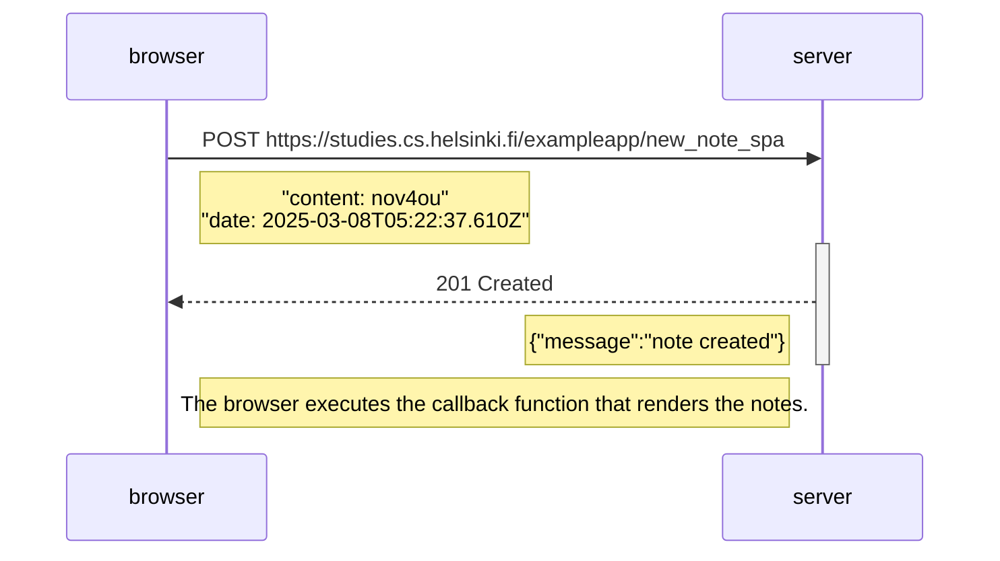

```mermaid
sequenceDiagram
    participant browser
    participant server

    browser->>server: POST https://studies.cs.helsinki.fi/exampleapp/new_note_spa
        Note right of browser: "content: nov4ou" <br> "date: 2025-03-08T05:22:37.610Z"
    activate server
    server-->>browser: 201 Created
        Note left of server: {"message":"note created"}

    deactivate server

    Note right of browser: The browser executes the callback function that renders the notes.

    

```